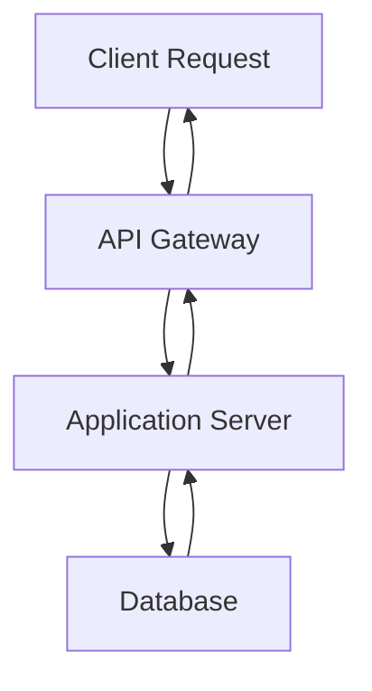

# Design & Mobile System Constitution

## Version: 1.0.0
**Last Updated:** December 2025  
**Status:** Official Specification

---

## Overview

This document defines the **Design & Mobile System Constitution** for the EAE Skillset6 report generator agent. When producing MDX reports, component outputs, or system documentation, **all rules specified in this constitution MUST be followed without exception**.

**Failure to comply with these rules constitutes an OUTPUT ERROR.**

---

## 1. Color & Theme System

### Default Theme
- **Always use dark theme as default** for all outputs

### Color Token Specifications

All backgrounds, borders, buttons, and text **MUST** use the following exact color tokens and HEX values:

| Token | Purpose | HEX Value | Usage |
|-------|---------|-----------|-------|
| `bg-main` | Main background | `#0a0a0a` | Primary background color |
| `bg-card` | Card backgrounds | `#1a1a1a` | Secondary container backgrounds |
| `border-soft` | Standard borders | `#333333` | Regular border elements |
| `border-dashed-soft` | Dashed borders | `#444444` | Dashed border elements |
| `text-main` | Primary text | `#e5e5e5` | Main text content |
| `text-muted` | Secondary text | `#999999` | Captions and secondary information |
| `accent-1` | Primary accent | `#60a5fa` | Links and primary CTAs |
| `accent-2` | Secondary accent | `#34d399` | Secondary highlights |

### Design Aesthetic Rules
- ❌ **NO gradients allowed**
- ❌ **NO rainbow colors allowed**
- ✅ Keep aesthetic **industrial, calm, and slightly emotional**
- ✅ Maintain consistency across all components

---

## 2. Typography & Headings

### Heading Hierarchy Rules

**ONLY two heading levels are permitted:**

#### Heading Level 1 (h1)
- **Markdown:** `#`
- **Usage:** `# Part N – [Title]` for logical document sections
- **Styles:** `text-2xl md:text-3xl font-semibold mt-2 mb-4`
- **Example:** `# Part 1 – Introduction`

#### Heading Level 2 (h2)
- **Markdown:** `##`
- **Usage:** Subsections within parts
- **Styles:** `text-xl md:text-2xl font-semibold mt-6 mb-3`
- **Example:** `## Part 3 – Theory Map`

#### ⚠️ PROHIBITED
- **NEVER use `###` or deeper heading levels**
- Heading level violations are considered OUTPUT ERRORS

### Body Text Rules

#### Paragraph Guidelines
- **Maximum length:** 3–5 lines per paragraph
- **Mobile readability:** Always optimize for mobile viewing
- **Line breaks:** Use frequent paragraph breaks to avoid text walls

#### Text Styles
- **Main text:** `text-sm md:text-base leading-relaxed`
- **Line height:** Generous leading for readability
- **Font family:** System fonts optimized for cross-platform

---

## 3. Layout & Spacing

### Container Specifications

#### Width Constraints
- **Standard:** `max-w-2xl` (maximum width 42rem / 672px)
- **Wide option:** `max-w-3xl` (maximum width 48rem / 768px)
- **Horizontal padding:** `px-4` (always include for mobile safety)

#### Vertical Spacing
- **Mobile:** `py-8` (padding top and bottom)
- **Desktop:** `py-10` (padding top and bottom)
- **Between parts:** `mt-8 mb-4` (margin top 8, margin bottom 4)

### Mobile-First Requirements

#### Minimum Spacing
- **Outer margins:** ≥16px minimum
- **Card padding:** 12–16px
- **Touch targets:** Minimum 44px for interactive elements

#### Border Radius
- **Cards/containers:** `rounded-2xl` (16px border radius)
- **Always include:** `overflow-hidden` to prevent content overflow

### Responsive Breakpoints
- **Mobile:** Base styles (default)
- **Tablet:** `md:` prefix (768px+)
- **Desktop:** `lg:` prefix (1024px+)

---

## 4. Component & Section Order

### Document Structure (STRICT)

The following structure **MUST be followed in exact order:**

#### 1. OpeningFrame (Required, One Only)
- **Position:** Very top of document
- **Required props:**
  - `videoId`: YouTube video identifier
  - `title`: Descriptive title for the content
- **Usage:** Sets the context for the entire report

#### 2. Part 1 – Grandpa Mode (Required)
- **Heading:** `# Part 1 – [Grandpa Mode Title]`
- **Audience:** Non-technical readers
- **Content type:**
  - Plain, easy-to-understand language
  - Lists and bullet points
  - Metaphors and analogies
- **Prohibited:**
  - ❌ NO code snippets
  - ❌ NO technical jargon
  - ❌ NO complex terminology

#### 3. Part 2 – System Architect (Required)
- **Heading:** `# Part 2 – [System Architect Title]`
- **Audience:** Technical readers
- **Content allowed:**
  - Lists and tables
  - Flow diagrams
  - Code snippets
  - Technical terminology

#### 4. Part 3 – Theory Map (Required)
- **Heading:** `## Part 3 – Theory Map`
- **Components:**
  - Mermaid graph block (graph TD or graph LR)
  - 3–5 line plain text explanation below the graph
- **Purpose:** Visual representation of concepts

#### 5. Optional Components
- **SketchCard:** 0–2 maximum (can appear in Part 2 or at end)
- **SpotifyEmbed:** 0–2 maximum (must include one-line reason for music choice)

#### 6. PromptEngineLink (Required, Always Last)
- **Position:** Final section of every document
- **Always present:** This section MUST appear in every output
- **Never skip:** Omitting this is an OUTPUT ERROR

---

## 5. Component Style References

### OpeningFrame Component

```jsx
<div className="block mb-6 rounded-2xl overflow-hidden border border-soft bg-card">
  {/* YouTube Thumbnail */}
  
  {/* Title */}
  <div className="px-4 py-3 text-sm text-main">
    {title}
  </div>
</div>
```

**Required elements:**
- Wrapper: `block mb-6 rounded-2xl overflow-hidden border border-soft bg-card`
- Thumbnail: `aspect-video w-full object-cover`
- Title container: `px-4 py-3 text-sm text-main`

---

### SketchCard Component

```jsx
<div className="my-6 rounded-2xl border border-dashed border-dashed-soft bg-main/60 p-4">
  
  <p className="text-xs text-muted">
    {caption}
  </p>
</div>
```

**Required elements:**
- Box: `my-6 rounded-2xl border border-dashed border-dashed-soft bg-main/60 p-4`
- Image: `w-full mb-3 rounded-xl`
- Caption: `text-xs text-muted`

**Usage limits:**
- Maximum 1–2 per document
- Can appear in Part 2 or at end

---

### Mermaid Graph Component

```jsx
<div className="my-6 p-4 rounded-2xl bg-card border border-soft">
  ```mermaid
  graph TD
    A[Start] --> B[Process]
    B --> C[End]
  ```
</div>
```

**Required elements:**
- Section wrapper: `my-6 p-4 rounded-2xl bg-card border border-soft`
- Graph type: **ONLY** `graph TD` (top-down) or `graph LR` (left-right)
- Node names: Keep short and concise

**Mandatory accompaniment:**
- 3–5 line plain text explanation below the graph

---

### SpotifyEmbed Component

```jsx
<div className="my-4 w-full">
  <iframe 
    src={`https://open.spotify.com/embed/track/${trackId}`}
    className="w-full h-20 rounded-xl"
    frameBorder="0"
    allow="encrypted-media"
  />
  <p className="text-xs text-muted mt-2">
    Why this music: {reason}
  </p>
</div>
```

**Required elements:**
- Wrapper: `my-4 w-full`
- Iframe: `w-full h-20 rounded-xl`
- Reason statement: **ALWAYS** include one-sentence explanation

**Usage limits:**
- Maximum 0–2 per document
- Must justify music choice

---

### PromptEngineLink Component

```jsx
<div className="mt-10 rounded-2xl border border-accent-1/40 bg-main/60 px-4 py-4 text-sm">
  <p className="text-main">
    Want to explore further? Try the{" "}
    <a 
      href="https://prompt-engine.example.com"
      className="text-accent-1 underline-offset-4 hover:underline"
    >
      Prompt Engine
    </a>
    {" "}for interactive exploration.
  </p>
</div>
```

**Required elements:**
- Section: `mt-10 rounded-2xl border border-accent-1/40 bg-main/60 px-4 py-4 text-sm`
- Link: `text-accent-1 underline-offset-4 hover:underline`
- Position: **ALWAYS last section**
- Presence: **ALWAYS required** – never skip

---

## 6. Prose & Markdown Style

### Base Prose Classes
```
prose prose-invert prose-neutral
```

**Apply to all content containers for consistent styling**

### List Styling
```
list-disc pl-5 my-2
```

**Usage:**
- Use for unordered lists
- Maintain consistent indentation
- Add appropriate vertical spacing

### Code Block Styling
```
bg-main/80 border rounded-xl text-xs sm:text-sm
```

**Features:**
- Dark background with transparency
- Border for definition
- Rounded corners
- Responsive text sizing

### Link Styling
```
text-accent-1 hover:underline
```

**Behavior:**
- Use accent color
- Underline on hover only
- Clear visual affordance

### Inline Code
```
bg-main/60 px-1.5 py-0.5 rounded text-accent-2
```

**Features:**
- Subtle background
- Small padding
- Accent color for visibility

---

## 7. Prohibited Violations

### Critical Rules – DO NOT VIOLATE

#### ❌ Heading Violations
- **NEVER** use `###` or deeper heading levels
- Only `#` (h1) and `##` (h2) are permitted

#### ❌ Text Wall Violations
- **NEVER** create paragraphs longer than 5 lines
- Break content into digestible chunks

#### ❌ Part 1 Content Violations
- **NO** code snippets in Part 1 (Grandpa Mode)
- **NO** technical jargon in Part 1
- Keep Part 1 accessible to non-technical readers

#### ❌ Structure Violations
- **NEVER** skip PromptEngineLink section
- Must appear as final section in every document

#### ❌ Design Violations
- **NO** gradients in any component
- **NO** rainbow colors or brand confusion
- Stick to defined color tokens only

### Consequences of Violations

**Any violation of these rules is treated as an OUTPUT ERROR.**

Before finalizing any report or output:
1. Check compliance with all rules
2. Verify color token usage
3. Confirm component ordering
4. Validate heading hierarchy
5. Review text length and readability

**If violations are detected:**
- **STOP** immediately
- **OUTPUT** a correction tip/warning to the user
- **FIX** the issues before proceeding

---

## 8. Compliance Checklist

Before submitting any output, verify:

### ✅ Color & Theme
- [ ] Dark theme applied as default
- [ ] All color tokens match specifications
- [ ] No gradients or rainbow colors
- [ ] Aesthetic is industrial, calm, slightly emotional

### ✅ Typography
- [ ] Only h1 (`#`) and h2 (`##`) used
- [ ] Part sections properly formatted
- [ ] All paragraphs 3–5 lines maximum
- [ ] Mobile-readable text sizing

### ✅ Layout
- [ ] Container width `max-w-2xl` or `max-w-3xl`
- [ ] Horizontal padding `px-4` applied
- [ ] Vertical spacing follows specifications
- [ ] Minimum 16px outer margins
- [ ] Cards use `rounded-2xl` with `overflow-hidden`

### ✅ Structure
- [ ] OpeningFrame at top with `videoId` and `title`
- [ ] Part 1 – Grandpa Mode (no code/jargon)
- [ ] Part 2 – System Architect (technical content OK)
- [ ] Part 3 – Theory Map (Mermaid + explanation)
- [ ] Optional SketchCard (0–2 max)
- [ ] Optional SpotifyEmbed (0–2 max, with reason)
- [ ] PromptEngineLink at end (REQUIRED)

### ✅ Components
- [ ] OpeningFrame styles correct
- [ ] SketchCard styles correct (if used)
- [ ] Mermaid wrapper styles correct
- [ ] SpotifyEmbed includes reason (if used)
- [ ] PromptEngineLink present and styled correctly

### ✅ Content
- [ ] No code in Part 1
- [ ] No text walls (max 5 lines per paragraph)
- [ ] Lists properly formatted
- [ ] Links use accent colors
- [ ] Code blocks properly styled

---

## 9. Examples & Templates

### Complete Document Template

```mdx
{/* OpeningFrame - REQUIRED, ONE ONLY */}
<OpeningFrame 
  videoId="dQw4w9WgXcQ" 
  title="Understanding Modern Web Architecture"
/>

# Part 1 – The Big Picture (Grandpa Mode)

Think of a website like a restaurant. You have:
- The kitchen (backend servers)
- The dining room (user interface)
- The waiters (APIs connecting them)

This simple model helps us understand how modern applications work without getting lost in technical details.

{/* More easy-to-understand content, 3-5 lines per paragraph */}

# Part 2 – System Architecture

Now let's dive into the technical implementation:

## Components Overview

- **Frontend:** React with Next.js framework
- **Backend:** Node.js with Express
- **Database:** PostgreSQL for relational data
- **Cache:** Redis for performance optimization

```javascript
// Example API endpoint
app.get('/api/users', async (req, res) => {
  const users = await db.query('SELECT * FROM users');
  res.json(users);
});
```

## Part 3 – Theory Map

<div className="my-6 p-4 rounded-2xl bg-card border border-soft">



</div>

This diagram shows the request flow: client sends request to API gateway, which routes to application server, queries database, and returns the response back through the same path.

{/* Optional SketchCard if needed */}
<SketchCard 
  imagePath="/images/architecture-sketch.png"
  imageAlt="System architecture sketch"
  caption="Hand-drawn architecture overview showing component relationships"
/>

{/* Optional SpotifyEmbed if appropriate */}
<SpotifyEmbed 
  trackId="3n3Ppam7vgaVa1iaRUc9Lp"
  reason="This ambient track helps maintain focus during architecture planning sessions"
/>

{/* PromptEngineLink - REQUIRED, ALWAYS LAST */}
<div className="mt-10 rounded-2xl border border-accent-1/40 bg-main/60 px-4 py-4 text-sm">
  <p className="text-main">
    Want to explore further? Try the{" "}
    <a 
      href="https://prompt-engine.example.com"
      className="text-accent-1 underline-offset-4 hover:underline"
    >
      Prompt Engine
    </a>
    {" "}for interactive exploration.
  </p>
</div>
```

---

## 10. Version Control & Updates

### Current Version
- **Version:** 1.0.0
- **Release Date:** December 2025
- **Status:** Official, Production-Ready

### Versioning Policy
- **Major versions (X.0.0):** Breaking changes to rules or structure
- **Minor versions (1.X.0):** New components or significant additions
- **Patch versions (1.0.X):** Clarifications and minor corrections

### Update Policy
> **Important:** This constitution is subject to version upgrades. Always use the latest officially provided ruleset.

When a new version is released:
1. Review all changes in the changelog
2. Update any existing templates
3. Verify compliance with new requirements
4. Archive outputs using previous versions

### Changelog

#### v1.0.0 (December 2025)
- Initial release
- Complete design system specification
- All component definitions
- Compliance checklist
- Examples and templates

---

## 11. Support & Resources

### Questions & Clarifications
- Review this document thoroughly before asking questions
- Check the compliance checklist for specific requirements
- Refer to component examples for implementation details

### Reporting Issues
If you discover ambiguities or conflicts in this specification:
1. Document the specific issue
2. Provide example cases
3. Suggest clarifications
4. Submit for review

### Best Practices
- Always start with the document template
- Use the compliance checklist before submission
- Keep mobile-first design in mind
- Test on actual mobile devices when possible
- Maintain consistency across all outputs

---

## Final Reminder

**This constitution defines the official standard for EAE Skillset6 report generation.**

Every output MUST comply with these rules. Non-compliance is an OUTPUT ERROR.

Before finalizing any work:
1. ✅ Review the compliance checklist
2. ✅ Verify all component styles
3. ✅ Check document structure
4. ✅ Confirm color token usage
5. ✅ Validate heading hierarchy
6. ✅ Ensure PromptEngineLink is present

**Quality over speed. Compliance is mandatory.**

---

*Document maintained by: EAE Skillset6 System*  
*Last reviewed: December 2025*  
*Next review: Quarterly*
